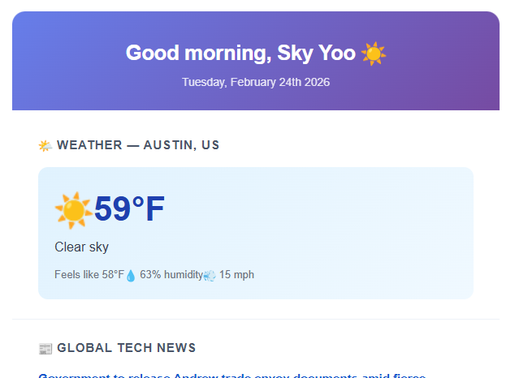

# ☀️ Morning Briefing

A self-hosted, fully configurable daily email digest. Every morning it fetches weather, tech news, and a quote — then delivers a clean HTML email to your inbox.

Runs on **Cloudflare Workers** — a cron trigger, no server, no container, nothing to keep awake.

---

## Features

- 🌤 **Weather** — current conditions for any city (OpenWeatherMap)
- 📰 **Hacker News** — top technical stories, filtered by score (no key needed)
- 🌍 **The Guardian** — global news with a non-US perspective
- ✨ **Quote of the Day** — no API key needed (zenquotes.io)
- 📬 **Email delivery** — via [Resend](https://resend.com)
- ⏰ **Cron trigger** — fires once a day, DST-correct, costs nothing when idle



---

## Prerequisites

- A [Cloudflare account](https://dash.cloudflare.com/sign-up) (the free plan is enough for this)
- Node.js 20+ — only to run `wrangler` locally; the Worker itself has no Node dependency
- A free [Resend](https://resend.com) API key
- A free [OpenWeatherMap](https://openweathermap.org/api) API key
- A free [The Guardian](https://open-platform.theguardian.com/access/) API key

---

## Quick start

```bash
# 1. Install tooling (wrangler + types; the Worker has zero runtime deps)
npm install

# 2. Set up secrets
cp .env.example .env
# → open .env and fill in your keys
./scripts/push-secrets.sh        # pipes them into Cloudflare, never echoes them

# 3. Deploy
npx wrangler deploy

# 4. Send one right now to check it works
curl -X POST -H "authorization: Bearer $(cat .trigger-secret)" \
  https://morning-brief.<your-subdomain>.workers.dev/run
```

Working on the template? `npm run dev` and open `/preview?key=…` — it renders the email
without sending anything. Copy `.env` to `.dev.vars` first so local runs see your keys.

---

## Configuration

Three places, in the order you'll reach for them:

| File | Holds | Committed? |
|---|---|---|
| `src/config.ts` | What's *in* the email — sections, page sizes, score thresholds | yes |
| `wrangler.jsonc` | Schedule, timezone, units, sender name | yes |
| Cloudflare secrets | API keys, your email, your name, your city | **no** |

### Schedule

The time lives in `wrangler.jsonc` **twice**, and both have to agree:

```jsonc
"vars": {
  "TIMEZONE": "America/Chicago",
  "DAILY_HOUR": "5",            // ← 5 AM local
  "DAILY_MINUTE": "0"
},
"triggers": {
  "crons": ["0 10,11 * * *"]    // ← 05:00 CDT = 10:00 UTC, 05:00 CST = 11:00 UTC
}
```

**Why two hours.** Cloudflare cron is UTC-only, so the Worker is woken at both the
CDT and CST candidate times and `shouldRunNow()` (`src/time.ts`) drops the one that
isn't 5 AM local. Without this the brief drifts an hour every March and November.
The `vars` decide *whether* to run; the cron decides *when the Worker wakes at all*.

To move the time, change both — use [crontab.guru](https://crontab.guru), and remember
the two UTC hours are `local + 5` and `local + 6` for US Central.

> ⚠️ Never use bare `new Date().getHours()` or `toLocaleTimeString()` in this codebase.
> A Worker's clock is UTC and there is no `TZ` to set, so those silently mean UTC.
> Use the helpers in `src/time.ts`, which all take an explicit timezone.

### Weather

`WEATHER_LOCATION` is a secret (a city name is deanonymizing); `WEATHER_UNITS` is a var.

```jsonc
"WEATHER_UNITS": "imperial"     // "imperial" (°F, mph) or "metric" (°C, m/s)
```

Location accepts a city name or `"lat,lon"` — e.g. `Austin` or `30.2672,-97.7431`.

### Content — `src/config.ts`

```ts
hackerNews: {
  enabled: true,
  pageSize: 5,
  minScore: 50,     // only stories with at least this many upvotes
  hoursBack: 24,
},

guardian: {
  enabled: true,
  sections: [
    { name: "Global Tech News", section: "technology", query: "", pageSize: 5, enabled: true },
    { name: "World News",       section: "world",      query: "", pageSize: 5, enabled: true },
  ],
},

quote: { enabled: true },       // false removes the section entirely
```

Every fetcher swallows its own errors and returns `null`, so a dead upstream costs you
that one section rather than the whole email.

---

## Email setup

Set `RESEND_API_KEY` and `RESEND_FROM_ADDRESS`. The default sender,
`onboarding@resend.dev`, works immediately with no DNS setup but can only send to the
address that owns the Resend account. To send anywhere else, verify your own domain in
the Resend dashboard and use an address on it.

---

## Secrets

| Secret | Used for |
|---|---|
| `RECIPIENT_NAME` | greeting in the email body |
| `RECIPIENT_EMAIL` | where the brief is sent |
| `WEATHER_LOCATION` | city name, or `lat,lon` |
| `RESEND_API_KEY` | sending the email |
| `RESEND_FROM_ADDRESS` | verified sender address |
| `OPENWEATHER_API_KEY` | weather |
| `GUARDIAN_API_KEY` | news |
| `TRIGGER_SECRET` | guards `POST /run` and `GET /preview` |

`./scripts/push-secrets.sh` pushes all of them from `.env` and generates
`TRIGGER_SECRET` on first run, saving a local copy to `.trigger-secret` (gitignored).
Verify with `npx wrangler secret list`.

`RECIPIENT_NAME` and `WEATHER_LOCATION` are secrets rather than `vars` on purpose:
`wrangler.jsonc` is committed, and a first name plus a city identifies you.

---

## Manual trigger

Both endpoints require `TRIGGER_SECRET`, as `Authorization: Bearer …` or `?key=…`.
Prefer the header — query strings are recorded in request logs.

```bash
KEY=$(cat .trigger-secret)
BASE=https://morning-brief.<your-subdomain>.workers.dev

curl -X POST -H "authorization: Bearer $KEY" "$BASE/run"       # send it now
curl        -H "authorization: Bearer $KEY" "$BASE/preview"    # render, don't send
```

If `TRIGGER_SECRET` is unset the endpoints return `503` and refuse everything.

---

## Operations

```bash
npx wrangler deploy            # ship it
npx wrangler tail              # live logs
npx wrangler secret list       # what's configured
npm run typecheck              # tsc --noEmit
npx wrangler deploy --dry-run  # verify the bundle without shipping
```

Cron runs also show up under **Workers → morning-brief → Logs** in the dashboard
(`observability` is enabled in `wrangler.jsonc`). A failed run throws rather than
logging quietly, so it surfaces as a failed invocation instead of a silent no-email.

Note that `wrangler dev` does **not** fire cron triggers locally — use `POST /run`
to exercise the job by hand.

---

## Project structure

```
morning-brief-tool/
├── public/
│   └── emailBrief.png      ← email preview image
├── scripts/
│   └── push-secrets.sh     ← .env → Cloudflare secrets
├── src/
│   ├── services/
│   │   ├── guardian.ts     ← The Guardian API fetcher
│   │   ├── hackernews.ts   ← Hacker News fetcher (no key needed)
│   │   ├── http.ts         ← shared JSON fetch + timeouts
│   │   ├── mailer.ts       ← Resend REST sender
│   │   ├── quote.ts        ← ZenQuotes fetcher
│   │   └── weather.ts      ← OpenWeatherMap fetcher
│   ├── config.ts           ← content settings + Env (start here)
│   ├── index.ts            ← scheduled() + fetch() handlers
│   ├── template.ts         ← HTML email renderer
│   ├── time.ts             ← timezone-safe formatting + the DST gate
│   └── types.ts            ← shared TypeScript types
├── .env.example            ← copy to .env, then push-secrets.sh
├── wrangler.jsonc          ← schedule, vars, cron triggers
├── package.json
└── tsconfig.json
```

---

## API key summary

| Service | Used for | Free tier | Link |
|---|---|---|---|
| Resend | Sending email | ✅ 3,000/month | [resend.com](https://resend.com) |
| OpenWeatherMap | Weather | ✅ 1,000 calls/day | [openweathermap.org/api](https://openweathermap.org/api) |
| The Guardian | Global news | ✅ 500 calls/day | [open-platform.theguardian.com](https://open-platform.theguardian.com/access/) |
| Hacker News | Tech stories | ✅ No key needed | automatic |
| ZenQuotes | Quote of the day | ✅ No key needed | automatic |

At one run a day this sits far inside every free tier, including Cloudflare's.

---

## Troubleshooting

**Email not sending** — check `npx wrangler tail` during a `POST /run`. `RESEND_API_KEY`
missing or `RECIPIENT_EMAIL` unset both throw with that name in the message. If you're
not using a verified domain, `onboarding@resend.dev` will only deliver to the Resend
account owner's address.

**Brief arrived an hour early or late** — `DAILY_HOUR` and the cron expression have
gone out of sync. Both must be updated together; see [Schedule](#schedule).

**Brief didn't arrive at all** — check the logs for `Skipping — … (DST twin firing)`.
Seeing it on *both* daily firings means `DAILY_HOUR`/`TIMEZONE` don't match either
cron hour.

**No weather** — new OpenWeatherMap keys take ~10 min to activate. Try a plain city
name: `London`, not `London, UK`.

**Quote missing sometimes** — expected. ZenQuotes rate-limits per source IP and Workers
egress from shared Cloudflare IPs, so that budget isn't ours alone; it's also genuinely
slow (10s+ cold). The section is dropped rather than retried. Set `quote.enabled = false`
in `src/config.ts` if the intermittency bothers you.

**No Hacker News section** — nothing cleared `minScore` inside `hoursBack`. Lower one
of them in `src/config.ts`.
